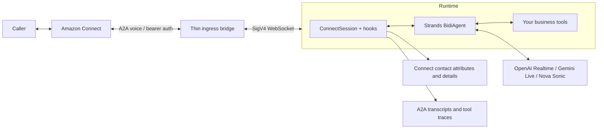

# Strands Connect

A reusable Amazon Connect native-voice extension for **Strands + Amazon Bedrock AgentCore**. Bring your own voice model, system prompt, and business tools. The adapter handles Connect A2A audio, contact-scoped tools, automatic contact attribute persistence, tool sounds, transcripts, and handback.

Early implementation, **v0.2.0**. Independent community extension; not an AWS, Strands, OpenAI, or Google product. The realtime Strands API is experimental, so tested versions are pinned. See [verification and limitations](docs/verification.md).



## Install

Python **3.14** is the development and AgentCore deployment default; Python 3.12 and 3.13 remain supported. Until a PyPI release exists, install directly from this repository:

```sh
pip install 'strands-connect[openai,agentcore] @ git+https://github.com/caylent/strands-connect.git@main'
# Or select gemini instead of openai. Pin a commit for reproducible applications.
```

No microphone or PyAudio dependency is required on the server. Provider imports are optional and lazy.

## Three runnable examples

- [Connect + OpenAI Realtime SDK](examples/connect_openai_realtime/README.md)
- [Connect + Gemini Live](examples/connect_gemini/README.md)
- [Connect + Amazon Nova 2 Sonic](examples/connect_nova_sonic_2/README.md)

All three run the same synthetic order lookup and contact lifecycle on AgentCore. They share the agent and contact logic; Nova 2 Sonic authenticates through AWS IAM, while OpenAI and Gemini use provider API keys. See [AgentCore and Connect setup](docs/deployment.md) for the ingress bridge, IAM, registration, recording, and validation steps. There are no account IDs, secrets, or pre-existing demo resources required by the source code.

## Use with your own agent

```python
from strands import tool
from strands_connect import ConnectSession, ContactPolicy
from strands_connect.contact import SESSION_ATTRIBUTES
from strands_connect.providers import make_model


@tool
async def lookup_order(order_id: str) -> dict:
    """Look up an order in your application."""
    return {"id": order_id, "status": "Shipped"}  # Replace with your API.


session = ConnectSession(
    socket,  # Async iterator of text frames, with send(), close(), and headers.
    instance_arn=your_instance_arn,
    connect_client=your_boto3_connect_client,
    model_factory=lambda: make_model("openai", "gpt-realtime", api_key=your_key),
    provider="openai",
    system_prompt="Help with order status; use tools for factual answers.",
    tools_factory=lambda session: [lookup_order],
    contact_policy=ContactPolicy(
        allowed_attributes=SESSION_ATTRIBUTES | {"OrderId", "OrderStatus"},
    ),
    result_mappers={
        "lookup_order": lambda result: {"OrderId": result["id"], "OrderStatus": result["status"]},
    },
)
await session.run()
```

To host your configured session in AgentCore, use the library's app factory:

```python
from strands_connect.agentcore import create_app

# Your factory receives the socket and a trusted runtime session ID.
app = create_app(your_session_factory)
app.run()
```

The `AfterToolCallEvent` hook saves and reads back mapped results **before the model receives the result**. Tools do not need to remember a separate logging call. A failed save becomes an error result rather than an unverified success. Never automatically repeat a non-idempotent business action to recover a logging failure.

## Extension design

- `agentcore.create_app`: reusable `/ws` entrypoint for your own session factory.
- `ConnectSession`: one trusted contact, one model instance, one Strands `BidiAgent`.
- `ConnectContactHooks`: public async Strands tool hooks, installed through `hooks=[...]`.
- `contact_tools`: standard `@tool` functions for approved attributes and completion/escalation; optional name/description updates.
- `ContactStore`: bounded writer queue, API readback, explicit failure and shutdown semantics.
- `model_factory`: any audio-capable `BidiModel` with PCM16 mono at 8/16/24 kHz.

This follows Strands' [extension template](https://github.com/strands-agents/extension-template) and [Bidi hooks](https://strandsagents.com/docs/user-guide/sdk/bidirectional-streaming/hooks/) patterns. `BidiAgent` 1.56 exposes `hooks` and `tools`; its constructor does **not** register standard `Agent(plugins=[...])` plugins. Consequently this package uses those supported APIs rather than an ignored `plugins` parameter.

## Contact records / CTR

[Contact persistence](docs/contact-records.md) distinguishes custom attributes, contact details, transcript/tool traces, and audio recordings. A CTR is a generated contact record, not an arbitrary document to patch. The adapter uses supported Connect APIs and A2A events; it does not rewrite CTR exports.

## Providers and development

See the [provider guide](docs/providers.md) for OpenAI SDK behavior, Gemini compatibility fixes, Nova 2 Sonic, and custom providers. See [CONTRIBUTING](CONTRIBUTING.md) for local checks and extension work.

```sh
uv sync --all-extras --group dev
uv run pytest
uv run ruff check .
uv build
```

## License

[Apache License 2.0](LICENSE).
